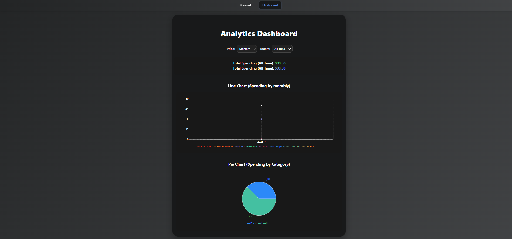
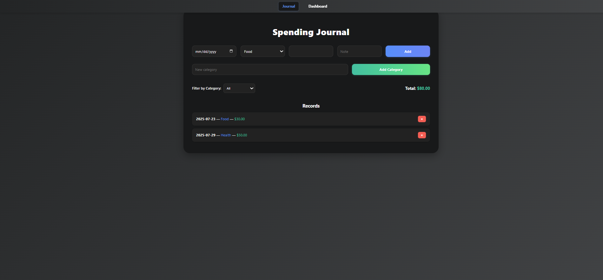

# Spending Tracker

<p align="center">
  
  
</p>

<p align="center">
  <b>Modern, privacy-first React app for tracking and analyzing your personal expenses.</b><br>
  <i>All data is stored locally in your browser—no backend, no account, 100% private.</i>
</p>

<p align="center">
  <a href="https://github.com/LaVireak/Spending_Tracker"></a>
  <a href="https://github.com/LaVireak/Spending_Tracker"></a>
  <a href="https://lavireak.github.io/Spending_Tracker/"></a>
</p>

---

## 🚀 Features

- **Journal Page**: Add, view, and manage spending records (date, category, amount, note)
- **Custom Categories**: Add your own spending categories on the fly
- **Analytics Dashboard**: Visualize spending by day, week, month, and category
- **Interactive Charts**: Line and pie charts powered by [Recharts](https://recharts.org/)
- **Local Storage**: All data is private and stays on your device
- **Initial Categories**: Preloaded from [`public/spending-category.json`](public/spending-category.json)
- **No Account Required**: No sign-up, no cloud sync, no ads

---

## 🛠️ Getting Started

1. **Install dependencies**
   ```powershell
   npm install
   ```
2. **Start the development server**
   ```powershell
   npm run dev
   ```
3. Open [http://localhost:5173](http://localhost:5173) in your browser.

---

## 🌐 Live Demo

- [View on GitHub Pages](https://lavireak.github.io/Spending_Tracker/)

---

## 📁 Project Structure

```
Spending_Tracker/
├── public/
│   ├── spending-category.json   # Initial spending categories
│   ├── Dashboard.png           # Dashboard screenshot
│   ├── Journal.png             # Journal screenshot
│   └── vite.svg                # Vite logo asset
├── src/
│   ├── App.jsx
│   ├── App.css
│   ├── main.jsx
│   ├── assets/
│   │   └── react.svg           # React logo asset
│   ├── components/             # Reusable UI components
│   ├── pages/                  # Journal and Dashboard pages
│   └── utils/                  # Utility functions
├── index.html
├── package.json
├── vite.config.js
└── README.md
```

---

## ⚙️ Customization

- **Add new categories** directly from the Journal page
- All data is stored in your browser's `localStorage` (no cloud sync)
- To change initial categories, edit [`public/spending-category.json`](public/spending-category.json)

---

## 🖼️ Screenshots

<p align="center">
  
  <br><br>
  
</p>

---

## 📦 Dependencies

- [React 19](https://react.dev/)
- [React Router DOM 7](https://reactrouter.com/)
- [Recharts 3](https://recharts.org/)
- [Vite](https://vitejs.dev/) (build tool)

---

## 👨‍💻 Credits

- Developed by **Vireak La**, **Chhialy Klo**, and **SHANN NEIL ORDONEZ ESTABILLO**

